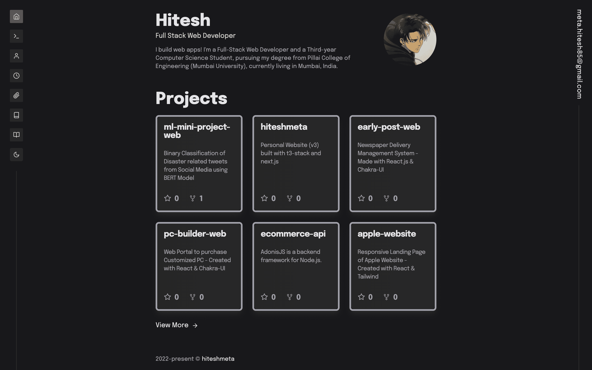

# Personal Portfolio

#### [Website](https://hiteshmeta.vercel.app)

## Getting Started

1. Clone the repository
2. Run `npm install` to install the dependencies
3. Run `npm run dev` to start the development server
4. Run `npm run build` to build the project
5. Run `npm run start` to start the production server

## Node Version

> v16.15.1

## Technologies Used & Links

- [Next.js](https://nextjs.org/)
- [TailwindCSS](https://tailwindcss.com/)
- [Typescript](https://www.typescriptlang.org/)

---

